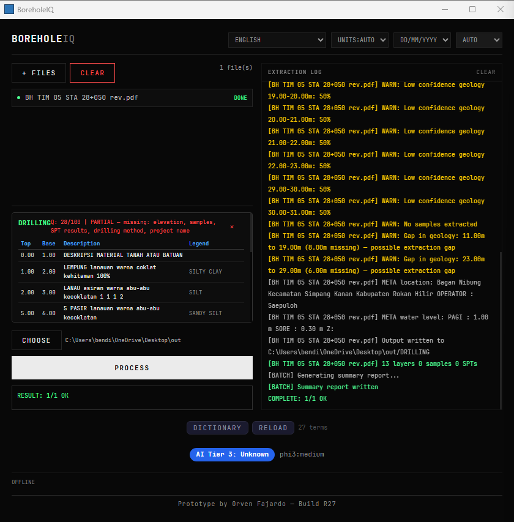

# BoreholeIQ v2 R27

**Prototype by Orven Fajardo**

BoreholeIQ converts borehole PDFs, images, and spreadsheets into **AGS4**, **CSV**, and **DIGGS XML**.

It runs **fully offline** on Windows. No cloud services, no API keys, and no data leaves the machine.

---

## Overview

BoreholeIQ processes geotechnical source files and produces structured outputs ready for downstream use, including OpenGround workflows.

**Supported inputs:**

* Borehole log PDFs
* Scanned reports and images
* CPT reports
* Laboratory certificates
* Spreadsheets

**Supported outputs:**

* AGS4
* OpenGround-ready CSV files
* DIGGS XML
* Quality and provenance reports

The system supports **25 languages**, including **Indonesian, Vietnamese, Thai, Malay, and Filipino**.



---

## How It Works

1. Add a borehole report PDF, image, or spreadsheet.
2. BoreholeIQ extracts text using either:

   * the native PDF text layer, or
   * OCR for scanned documents.
3. The extracted content is parsed using:

   * a local AI model via **Ollama**, or
   * deterministic pattern matching.
4. The application generates structured outputs and a quality report.

---

## Installation

Copy the `rev2_r27` folder to a Windows machine.

Then:

1. Right-click `deploy.bat`
2. Select **Run as administrator**

On a fresh machine, installation typically takes around **25 minutes**.

The deployment process installs all required components from scratch, including:

* Build tools
* OCR engine
* Local AI runtime
* Application dependencies

If deployment stops partway through, run `deploy.bat` again. Completed steps are skipped automatically.

**Output executable:**

```text
C:\BoreholeIQ\src-tauri\target\release\borehole-iq.exe
```

---

## Outputs

### Per borehole

* `output.ags` — AGS4 output with self-validation
* `loca.csv` — OpenGround-ready LOCA data
* `geol.csv` — OpenGround-ready geology data
* `samp.csv` — OpenGround-ready sample data
* `ispt.csv` — OpenGround-ready SPT data
* `openground_mapping.xml` — CSV import mapping for OpenGround
* `output.diggs.xml` — DIGGS 2.5.x output for US workflows
* `manifest.json` — Extraction summary with quality score
* `provenance.json` — Audit trail

### Per batch

* `project.ags` — Combined AGS4 file
* `batch_summary.html` — Batch processing summary

---

## AI Model Selection

During deployment, BoreholeIQ detects available RAM and selects an appropriate model automatically.

| RAM            | Model              | Notes                     |
| -------------- | ------------------ | ------------------------- |
| Less than 8 GB | None               | Pattern matching only     |
| 8–11 GB        | `phi3:mini`        | Basic AI mode             |
| 12–23 GB       | `phi3:medium`      | Default for most machines |
| 24–47 GB       | `llama3.1:8b`      | Higher accuracy           |
| 48+ GB         | `mistral-nemo:12b` | Best extraction quality   |

### Use a Different Model

Run:

```bash
ollama pull llama3.1:70b
```

Create this file:

```text
%LOCALAPPDATA%\BoreholeIQ\ai_config.json
```

With this content:

```json
{
  "model": "llama3.1:70b",
  "timeout_secs": 600,
  "context_chars": 12000
}
```

Then restart the application.

**Notes:**

* AI runs on **CPU**
* The first file may take **2 to 5 minutes** while the model loads
* Subsequent files are usually faster
* If AI is unavailable or too slow, the app falls back to pattern matching

---

## Usage Notes

### First file is slow

The AI model loads into RAM on first use. This is expected.

### Wrong language selected

Check the language dropdown. For example, Indonesian reports should use **Indonesian**, not **English**.

### Low confidence warnings

Pattern matching found data, but some depths may be approximate. AI mode usually improves extraction quality.

### Batch processing

Add multiple files and click **Process** to generate a combined `project.ags` and summary report.

### Preview

Click **DONE** on a completed file to preview extracted layers.

### CLI mode

```bash
boreholeiq.exe --batch input_dir --output output_dir --lang eng
```

### Dictionary learning

The application stores learned extraction data in:

```text
%LOCALAPPDATA%\BoreholeIQ\dictionary\
```

---

## System Requirements

| Requirement | Minimum                  | Recommended |
| ----------- | ------------------------ | ----------- |
| OS          | Windows 10 64-bit        | Windows 11  |
| RAM         | 4 GB (pattern mode only) | 16 GB       |
| Disk space  | 10 GB                    | 50 GB       |

---

## Troubleshooting

| Problem                  | Recommended action                                                                                                                 |
| ------------------------ | ---------------------------------------------------------------------------------------------------------------------------------- |
| Build fails at Step 4    | Check that `scaffold_files.json` is the expected size. Delete `%LOCALAPPDATA%\BoreholeIQ\state\4-app.ok` and run deployment again. |
| AI times out             | This is normal on the first file while the model loads. Wait, or switch to **REGEX** mode.                                         |
| AI never starts          | Create `ai_config.json` using a valid model name from `ollama list`.                                                               |
| No layers extracted      | Try a different extraction mode (**Auto** vs **Pattern**) and verify the selected language.                                        |
| SSL errors during deploy | Common on some corporate networks. The deploy process is designed to handle this automatically.                                    |

---

## What Changed from R26

R27 adds:

* Batch AGS4 output
* DIGGS XML export
* OpenGround mapping XML
* AGS4 self-validation
* Quality scoring
* Provenance audit output
* Page classification
* Depth calibration
* Gap detection
* XLSX and AGS input support
* Drag-and-drop support
* Output preview panel
* Language auto-detection and persistence
* Southeast Asian keyword support
* AI warm-up and extended CPU inference timeout
* Cleaner UI

---

## Technology Stack

Built with:

* **Tauri 2**
* **React**
* **Rust**
* **Tesseract 5** for OCR
* **Ollama** for local AI inference

If you want, I’ll give you an even better **GitHub-polished version** next with badges, a feature table, and a cleaner top section.
